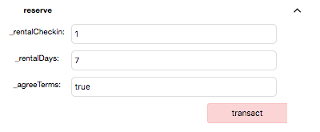
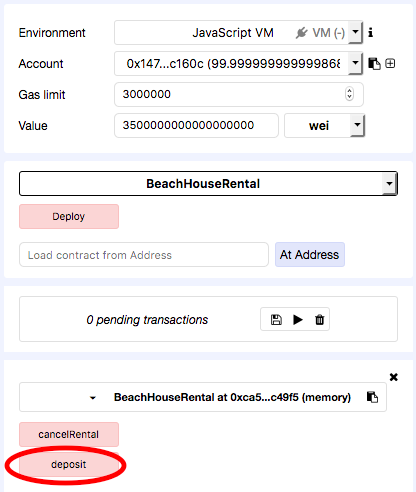

## Solidity-beach-rental

#### Solidity smart contract example

A basic rental smart contract for a beach vacation property. This is a practice exercise (i.e. not extensively tested for deploying on the Ethereum mainnet). It has been tested using [Remix](https://remix.ethereum.org).

----
#### Basic instructions to run:
1) Open [Remix](https://remix.ethereum.org) in a browser.

2) Deploy and populate the reserve function. For example:

3) Run rentalTotal and paste the value (in wei) to Value at top.

4) Ensure the selected Account is for renter and run deposit function:

