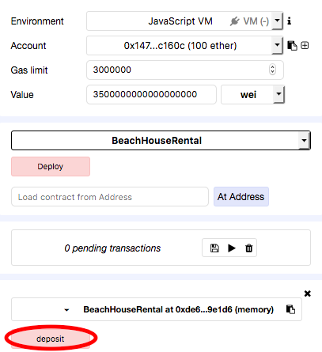

## Solidity-beach-rental

#### Solidity contract example

A basic rental contract for a beach vacation property. This is a practice exercise (i.e. not extensively tested for deploying on the Ethereum mainnet). It has been tested using [Remix](https://remix.ethereum.org).

----
#### Basic instructions to run on Remix:
1) Deploy and populate the reserve function. For example:

2) Run getRentalTotal and paste the value (in wei) to Value at top.

3) Ensure the selected Account is for renter and run deposit function:

